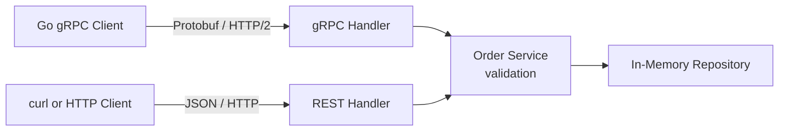

# Go gRPC and REST Order Demo

A minimal Go application that exposes the same order-creation logic through gRPC and REST. Both APIs validate requests through one service and store orders in one in-memory repository.

## Run

Requires Go 1.25 or later.

Start the server:

```bash
go run ./cmd/server
```

The server starts gRPC on `localhost:50051` and REST on `localhost:8080`.

### gRPC

Run the Go gRPC client:

```bash
go run ./cmd/client
```

### REST

Send the equivalent request as JSON over HTTP:

```bash
curl -X POST http://localhost:8080/orders \
  -H "Content-Type: application/json" \
  -d '{"user_id":"user-1","symbol":"BTCUSD","price":50000,"amount":0.1}'
```

Example response:

```json
{"order_id":"order-...","status":"created"}
```

## Request flow



## gRPC vs REST

| gRPC | REST |
| --- | --- |
| Contract defined in `order.proto` | Contract expressed through HTTP and JSON |
| Binary Protobuf messages over HTTP/2 | Human-readable JSON over HTTP |
| Generated, strongly typed Go client | Callable with any HTTP client, such as `curl` |
| Errors use gRPC status codes | Errors use HTTP status codes |

## Project structure

```text
cmd/server/                 gRPC server and graceful shutdown
cmd/client/                 example client
internal/transport/gRPC/    RPC handler
internal/transport/rest/    HTTP/JSON handler
internal/service/           validation and business logic
internal/repository/        thread-safe in-memory storage
proto/order.proto           service and message definitions
grpc-demo/proto/orderpb/    generated Go protobuf code
```

Orders are not persisted and are lost when the server stops.
