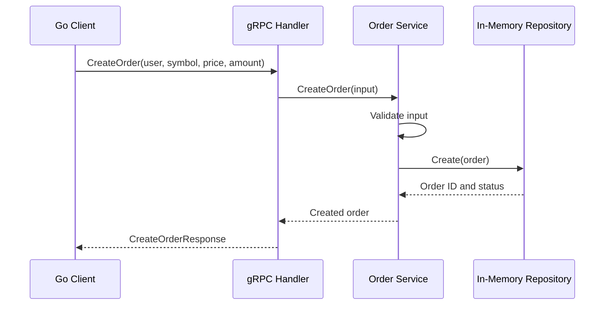

# Go gRPC Order Demo

A minimal gRPC client/server application in Go. It exposes a `CreateOrder` RPC, validates the request, and stores the order in memory.

## Run

Requires Go 1.25 or later.

Start the server:

```bash
go run ./cmd/server
```

In another terminal, run the client:

```bash
go run ./cmd/client
```

The server listens on `localhost:50051`, and the client submits a sample BTC/USD order.

## Request flow



## Project structure

```text
cmd/server/                 gRPC server and graceful shutdown
cmd/client/                 example client
internal/transport/gRPC/    RPC handler
internal/service/           validation and business logic
internal/repository/        thread-safe in-memory storage
proto/order.proto           service and message definitions
grpc-demo/proto/orderpb/    generated Go protobuf code
```

Orders are not persisted and are lost when the server stops.
